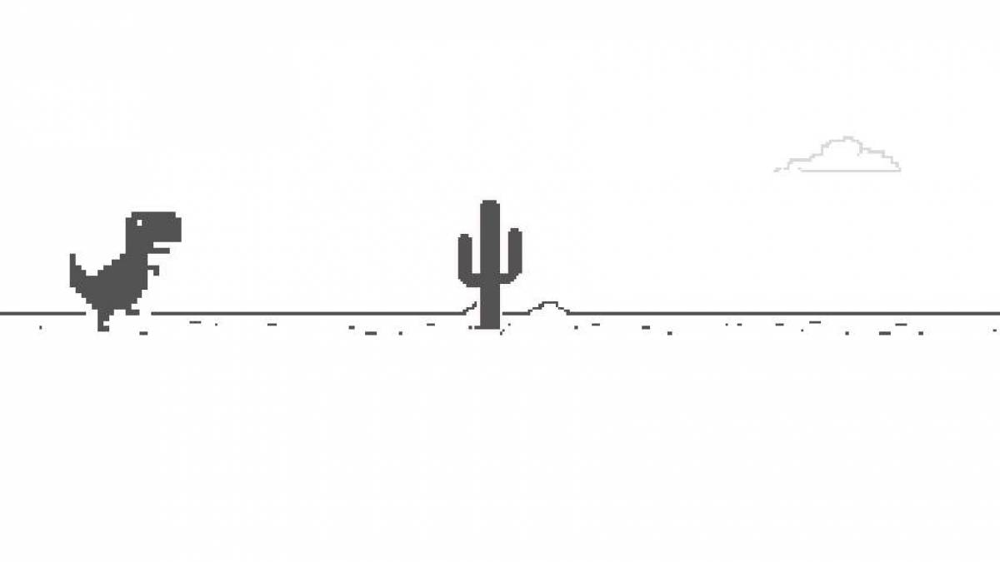

Recriando o famoso jogo do dinossauro sem internet

 <a href="#computer-sobre">• Sobre</a> | 
 <a href="#memo-roteiro">• Roteiro</a> | 
 <a href="#hammer-tecnologias">• Tecnologias</a> | 
 <a href="#boy-autor">• Autor</a> 

## :computer: **Sobre**

Desafio pratico de recreação do Jogo do dinossauro,famoso no Chrome por nos entreter quando estamos sem conexão. 

## :memo: **Roteiro**

Nesse projeto foi utilizando HTML, CSS e Javascript de forma introdutória, abordando de maneira simples diversos conceitos introdutórios importantes para programação na web como tags básicas de HTML, manipulação de eventos, funções e manipulação de elementos HTML usando JavaScript, estilização e animações básicas com CSS.

 

## :hammer: **Tecnologias**

 HTML
 JavaScript
 CSS

## :girl: **Autora**

Feito por Alane G. Brito ❤️

